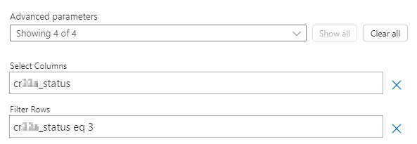

---
lab:
  title: 'Laboratório 7: Filtros de gatilho'
  module: 'Module 5: Power Automate’s deep integration across multiple data sources'
---

# Laboratório de prática 7 – Filtros de gatilho

Neste laboratório, você filtrará um gatilho de atualização.

## O que você aprenderá

- Como filtrar gatilhos

## Macroetapas do laboratório

- Criar um fluxo automatizado
- Adicionar filtro de coluna
- Adicionar filtro de consulta

## Pré-requisitos

- É necessário ter concluído **Laboratório 2: Modelo de dados**

## Etapas detalhadas

## Exercício 1 – Nome do esquema

### Tarefa 1.1 – Nome do esquema de coluna

1. Navegue até o portal do Power Apps Maker `https://make.powerapps.com`

1. Verifique se você está no ambiente **Dev One**.

1. No painel de navegação esquerdo, selecione **Tabelas**.

1. Selecione **Oportunidade**.

1. Em **Esquema**, selecione **Colunas**.

1. Selecione a coluna **Status**.

    

1. Expanda **Opções avançadas**.

    

1. Copie o **Nome lógico** para uso no fluxo.

   > **Observação:** o prefixo da coluna Status pode ser diferente.

## Exercício 2 – Criar fluxo automatizado

### Tarefa 2.1 – Criar o gatilho

1. Navegue até o portal do Power Automate `https://make.powerautomate.com`.

1. Verifique se você está no ambiente **Dev One**.

1. Selecione a guia **+ Criar** no menu de navegação à esquerda.

1. Selecione **Fluxo de nuvem automatizado**.

1. Insira `Opportunity Closed` em **Nome do fluxo**.

1. Insira `Dataverse` na pesquisa todos os gatilhos.

1. Selecione **Quando uma linha for adicionada, modificada ou excluída**.

1. Selecione **Criar**.

### Tarefa 2.2 – Configurar o gatilho

1. Selecione a etapa **Quando uma linha for adicionada, modificada ou excluída**.

1. Clique no nome da etapa **Quando uma linha for adicionada, modificada ou excluída** e insira `Opportunity changed`

1. Selecione **Modificado** para **Tipo de alteração**.

1. Escolha **Oportunidades** em **Nome da tabela**.

1. Escolha **Organização** em **Escopo**.

    

### Tarefa 2.3 – Enviar email

1. Selecione o ícone **+** na etapa de gatilho e selecione **Adicionar uma ação**.

1. Insira `email` na pesquisa.

1. Selecione **Enviar um email (V2)** em **Office 365 Outlook**.

1. Clique no nome de etapa **Enviar um email (V2)** e insira `Notify by email`

1. Selecione o campo **Para** e escolha **Inserir valor personalizado**.

1. Insira sua ID de usuário do locatário em **Para**.

1. Clique no campo **Assunto** e insira `Opportunity closed`

1. Selecione o campo **Corpo** e selecione o ícone de conteúdo dinâmico.

1. Selecione **Assunto da oportunidade** em **Oportunidade alterada**.

1. Selecione o campo **Corpo**, selecione o ícone de conteúdo dinâmico e selecione **Ver mais**.

1. Selecione **Status** em **Oportunidade alterada**.

### Tarefa 2.4 – Filtro de coluna

1. Selecione a etapa de gatilho **Oportunidade alterada**.

1. Selecionar **Mostrar tudo**

1. Clique no campo **Selecionar colunas** e insira o **Nome lógico** do exercício anterior, por exemplo: `cr977_status`

   > **Observação:** O prefixo da coluna de status será diferente.

### Tarefa 2.5 – Filtro de linha

1. Selecione a etapa de **Oportunidade alterada**.

1. Selecionar **Mostrar tudo**

1. Clique no campo **Filtrar linhas** e insira `cr977_status eq 3` usando o **Nome lógico** do exercício anterior.

    

    > **Observação:** O prefixo da coluna de status será diferente.

1. Selecione **Salvar**.

1. Clique no botão **<-****Voltar** no canto superior esquerdo da barra de comandos.

